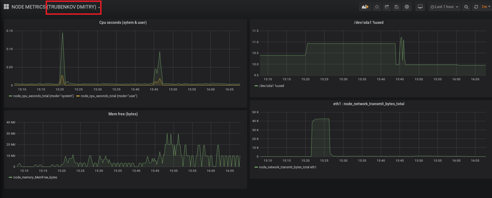

# Описание решения.

1. На _VM_ установлен  _Prometheus_.
2. На той же _VM_ установлен _Node exporter_ и запущен _as is_ для сбора "метрик по умолчанию" с _VM_.
3. В конфиге _Prometheus_ (_prometheus.yml_) настроен сбор метрик с _Node exporter_.
```  
- job_name: 'node'
    static_configs:
    - targets: ['localhost:9100']
```
4. В _Prometheus->Graph_ выбраны метрики для CPU, RAM, HDD. Network и  проверены  PQL-запросы.
5. На той же _VM_ установлена _Graphana_. 
6. В _Graphana_ в качестве datasource указан _Prometheus_.
7. Построен дашборд c ранее проверенными PQL-запросами:


